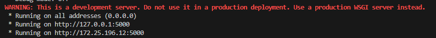
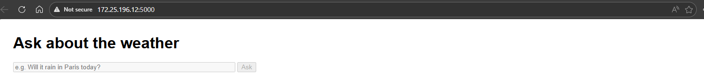

# Chatbot AI application for local web

This responsity is for assignments including Programming with Python and Project AI use case

Author: HOANG AN PHAM

Matriculation number: 10245923

This project presents a weather chatbot AI designed to run on a local web interface within a Linux environment. The application demonstrates how to integrate an open‑source Large Language Model (LLM) into a chatbot system and connect it with an external weather API to deliver real‑time weather information. By combining natural language processing with a local deployment, the chatbot can interpret user queries, extract relevant location details, and generate accurate, context‑aware responses without relying on external closed‑source services.

The project also highlights how LLMs can be embedded into web‑based applications, offering flexibility, reproducibility, and privacy by running entirely on local infrastructure. This repository serves as a practical example of building an AI‑driven chatbot pipeline, showcasing both the integration of LLMs and the deployment of a lightweight web interface for interactive communication.


Requirements:

- linux operation
- 8GB ram minimum
- 8GB rom for downloading package and LLM model
  
Note:
- This application does not support the CUDA (GPU) at this time, it will takes time for the LLM to response to your question, it can take about 2 minutes to get the answer from LLM depending on your hardware.
- API key free for weatherAPI will be provided in run.py; just up ultil April
  
## Set up
1. Clone respon
```bash
git clone https://github.com/Lk13Antkoo/weatherr_chatbot.git
cd weatherr_chatbot
```
2. Download fine-tuned quantized model
```bash
wget https://huggingface.co/TheBloke/Llama-2-7B-Chat-GGUF/resolve/main/llama-2-7b-chat.Q4_K_M.gguf
```

3. Create python virtual environment and activate it
```bash
python -m venv venv
source ./venv/bin/activate
```

4. Install packages
```bash
pip install -r requirements.txt
python -m spacy download en_core_web_sm
```

## Running
1. On the Terminal, run the command below
```bash
python run.py
```
2. To open the local web interface, click on the localhost address in the terminal (example in the image).


4. On local web, type in the box to ask about the current weather information. ^^ Have fun.


From terminal you can see the process, for debugging purpose only, the extracted place and weather information will be shown only on terminal.

